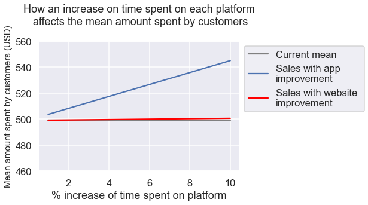

# E-commerce Platform Usage

Business Problem: An e-commerce company aims to imprrove its online platforms to increase customer retention and encourage higher purchasing. However, due to limited funds, they can only invest in either their app or website. The company has shared data on time spent, usage patterns, and money spent on both platforms. They seek insights on which platform would present a better return on investment (ROI).

To do so, we will analyze spending patterns and formulate a regression model. This model will enable us to predict how an increase in time spent on each platform will affect the spending habits.

---

## Data Dictionary:

|Column|Description|
|-----|-----|
|years-custommer-register|Years since the custommer registred on the platform.|
|avg-clicks-per-session|Average number of clicks in each session.|
|time-spent-on-app|Total time spent on the app in minutes.|
|time-spent-on-website|Total time spent on the website in minutes.|
|total-amount-spent|Total amount spent by client on one month, in USD|

---

## Conclusion

Based on the analyzis that was made building a predictive model and predicting the possible scenarios, the best choice for the company to improve it's sales, would be to work on the app platform. **1% increase on time** spent by clients **using the app**, would **represent a 0.9% increase on sales**, on the other hand, **1% increase on website usage time** would only lead to a **0.04% increase on sales.**

The chart belows presents a more graphic comparrison on how an improvement on each platform would affect the mean total amount a client spends in one month.

